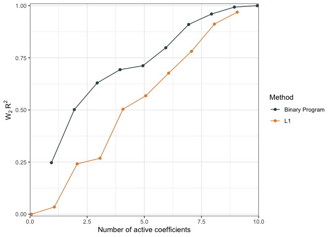
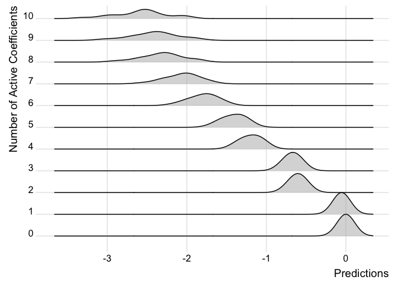

# `WpProj`: Linear p-Wasserstein Projections

<!-- badges: start -->

[](https://github.com/ericdunipace/WpProj/actions/workflows/R-CMD-check.yaml)
[](https://CRAN.R-project.org/package=WpProj)
<!-- badges: end -->

The goal of `WpProj` is to perform Wasserstein projections from the
predictive distributions of any model into the space of predictive
distributions of linear models. This package employs the methods as
described in [Eric Dunipace and Lorenzo Trippa
(2020).](https://arxiv.org/abs/2012.09999) \<arXiv:2012.09999\>.

The Wasserstein distance is a measure of distance between two
probability distributions. It is defined as

$$W_p(\mu,\nu) = \left(\inf_{\pi \in \Pi(\mu,\nu)} \int_{\mathbb{R}^d \times \mathbb{R}^d} \|x-y\|^p d\pi(x,y)\right)^{1/p}$$

where $\Pi(\mu,\nu)$ is the set of all joint distributions with
marginals $\mu$ and $\nu$.

In the our package, if $\mu$ is the original prediction from the
original model, such as from a Bayesian linear regression or a neural
network, then we seek to find a new prediction $\nu$ that minimizes the
Wasserstein distance between the two,

$$\mathop{\text{argmin}} _ {\nu} W _ {p}(\mu,\nu) ^ {p},$$

subject to the constraint that $\nu$ is a linear model.

To reduce the complexity of the number of parameters, we add an L1
penalty to the coefficients of the linear model to reduce the complexity
of the model space,

$$\mathop{\text{argmin}} _ {\nu}  W _ {p}(\mu,\nu) ^ {p} + P_{\lambda}(\nu),$$

where $P_\lambda(\nu)$ is a penalty on the complexity of the model space
such as the the $L_1$ penalty on the coefficients of the linear model.

## Installation

You can install the development version of WpProj from
[GitHub](https://github.com/) with:

``` r
# install.packages("devtools")
devtools::install_github("ericdunipace/WpProj")
```

## Example

This is a basic example running the `WpProj` function on a simulated
dataset. Note we create a pseudo posterior from a simple dataset for
illustration purposes:

``` r
library(WpProj)
set.seed(23048)
# note we don't generate believable data with real posteriors
# these examples are just to show how to use the function
n <- 32
p <- 10
s <- 21

# covariates and coefficients
x <- matrix( stats::rnorm( p * n ), nrow = n, ncol = p )
beta <- (1:10)/10

#outcome
y <- x %*% beta + stats::rnorm(n)

# fake posterior
post_beta <- matrix(beta, nrow=p, ncol=s) + stats::rnorm(p*s, 0, 0.1)
post_mu <- x %*% post_beta #posterior predictive distributions

# fit models
## L1 model
fit.p2     <-  WpProj(X=x, eta=post_mu, power = 2.0,
                   method = "L1", #default
                   solver = "lasso" #default
)

## approximate binary program
fit.p2.bp <-  WpProj(X=x, eta=post_mu, theta = post_beta, power = 2.0,
                   method = "binary program",
                   solver = "lasso" 
                   # this is the default because 
                   # the approximate algorithm is faster
)
```

We can compare the performance of the models using the `distCompare`
function (measuring distance between the reduced models and the original
model) and then generate a plot

``` r
dc <- distCompare(models = list("L1" = fit.p2, "Binary Program" = fit.p2.bp),
                  target = list(parameters = post_beta,
                                  predictions = post_mu))
p <- plot(dc, ylabs = c("2-Wasserstein Distance", "2-Wasserstein Distance"))
p$parameters + ggplot2::ggtitle("Parameters")
p$predictions + ggplot2::ggtitle("Predictions")
```


We can also compare performacne by measure the relative distance between
a null model and the predictions of interest as a pseudo $R^2$

``` r
r2.null  <- WPR2(projected_model = dc) # should be between 0 and 1
plot(r2.null)
```



We can also examine how the predictions change in the models as more
covariates are added for individual observations.

``` r
ridgePlot(fit.p2, index = 21, minCoef = 0, maxCoef = 10)
```



Note how the predictions get better the more coefficients are added and
the distribution looks closer to the full posterior predictive.

We can also compare the two models like so:

``` r
ridgePlot(list("L1" = fit.p2, "Binary Program" = fit.p2.bp), index = 21, minCoef = 0, maxCoef = 10, full = post_mu[21,])
```


# References

[Eric Dunipace and Lorenzo Trippa
(2020).](https://arxiv.org/abs/2012.09999)
